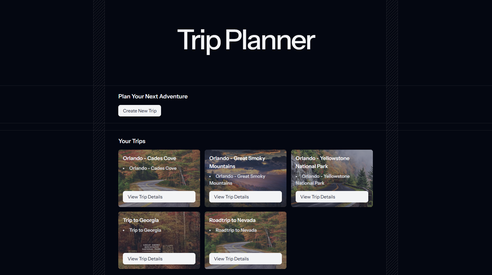

# 🌲🏕️🚙 Trip Planner

A fun personal project to practice **Laravel** and **Tailwind CSS** while building a minimal trip planning app.

##  About

Trip Planner is a lightweight web application for creating and organizing travel plans. It allows users to create trips, associate them with flights, accommodations, and directions, and display them with a stylish UI featuring Tailwind CSS. This project is built for learning purposes, focusing on Laravel's Blade templating and Tailwind CSS without JavaScript frameworks like React.

This is not intended for production use—just a playground for experimenting with PHP, Laravel, and CSS!

## 📸 Screenshots



*Main interface showing a trip card with hover effects and a background image.*

## 🛠️ Built With

- [Laravel](https://laravel.com/) – PHP web framework
- [Tailwind CSS](https://tailwindcss.com/) – Utility-first CSS framework
- [MySQL](https://www.mysql.com/) – Relational database
- [Blade](https://laravel.com/docs/blade) – Templating engine
- [Google Maps Embed API](https://developers.google.com/maps/documentation/embed) – For displaying maps and directions

## 🌟 Features

- Create and manage trips with titles, flights, accommodations, and directions.
- Display trip cards with random background images and elegant hover effects (e.g., scale and shadow transitions).
- View trip details with embedded Google Maps for directions.
- Minimal design using Blade templates and Tailwind CSS, no JavaScript frameworks.

##  Setup

### Prerequisites
- PHP >= 8.0
- Composer
- MySQL
- Node.js and npm (for Tailwind CSS)
- Git

### Installation
1. Clone the repository:
   ```bash
   git clone https://github.com/Anastasia095/Trip-Planner.git
   cd Trip-Planner
